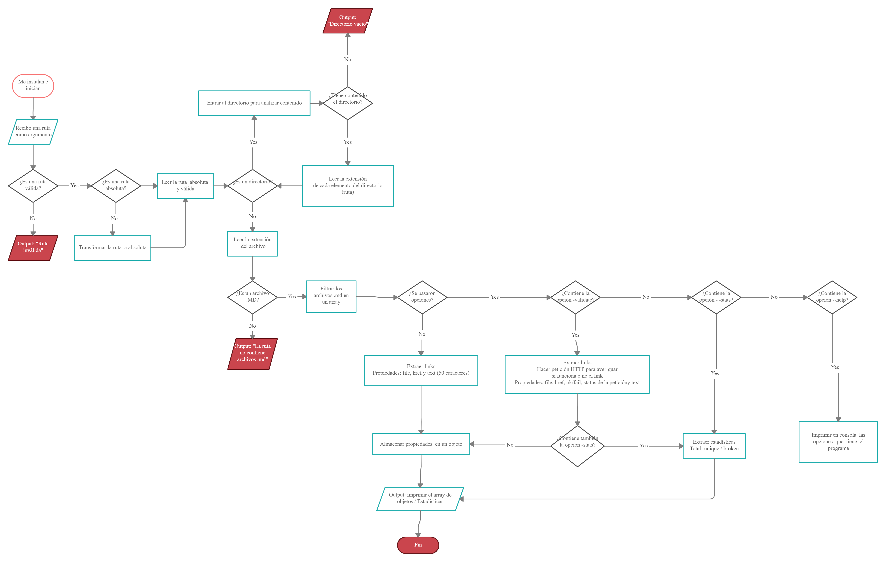

# Markdown Links

## 1. About the project

Md-Links is a library that parses links inside a markdown file. Validate links and show stats.

## 2. Flowchart

## 3. Getting started

### Install
  npm install 

## 4. Usage

npm <"path"> <options>
 --validate, --v: Validate Links
 --stats, --s: Show Stats
 --validate --stats, --v --s, --stats --validate --s --v: Stats about validated links
 --help, --h: Show options
